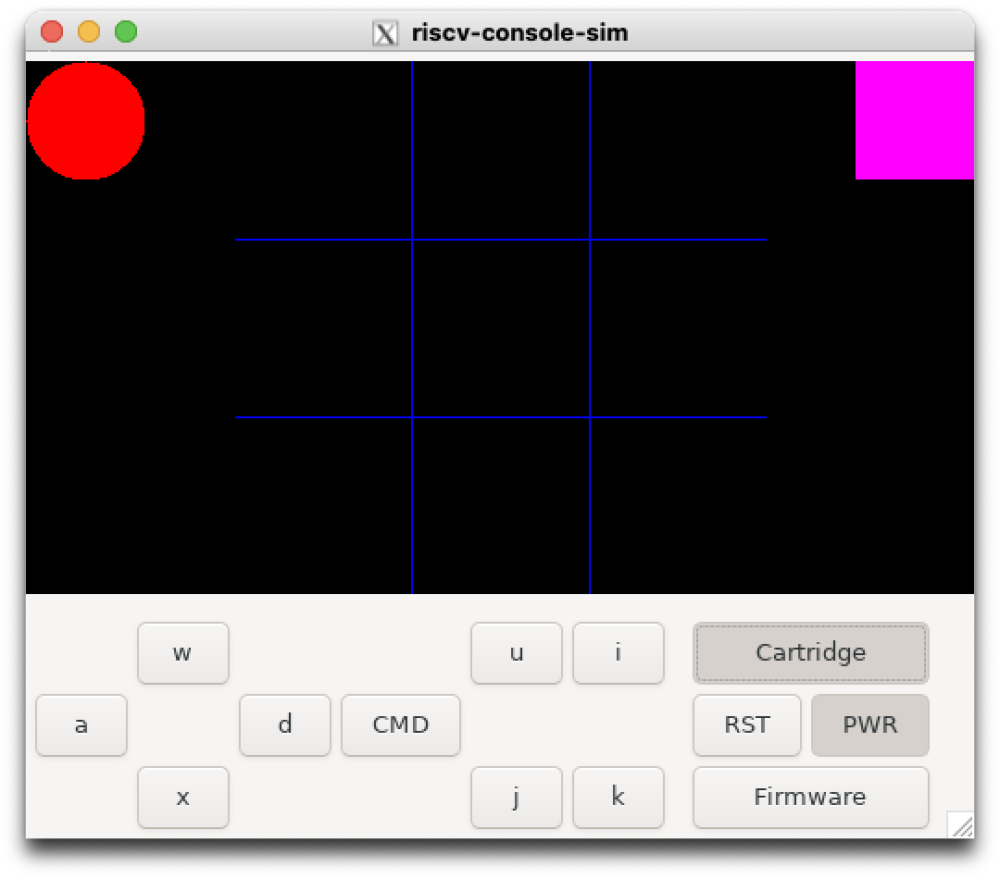

# ECS251 Group 10 RISC-V Console OS and Tic-tac-toe Game Cartridge

This folder contains both console firmware and corresponding game cartridge to be run in the simulated RISC-V console provided by Professor Nitta at https://github.com/UCDClassNitta/riscv-console. 

## Set-up Instructions
1. If you have not installed the simulator software yet, install it from here: https://github.com/UCDClassNitta/riscv-console. Ensure that the simulator works using the provided riscv-example binary files. 

2. Place the `phase_final` project folder into the `riscv-console` folder so that it can be accessed by the simulator.

3. On your terminal, change your directory to your `riscv-console/phase_final/firmware` folder then run `make` to create the firmware binary file.

3. From there, change your directory to your `riscv-console/phase_final/cartridge`, then run `make` to create the catridge binary file.

4. Launch the docker container with `./rvconsole.sh` and start up the simulator with `/code/runsim.sh`. The simulator display should be blank.

5. Load the firmware into the simulator by clicking on the firmware button and navigating to the `/code/phase_final/firmware/bin` directory, then clicking on either the `riscv-console-example`, or `riscv-console-example.strip` file. Upon pushing the PWR button, an`OS STARTED` should appear on the screen. 

6. Now load the catridge into the simulator by clicking on the cartridge button and navigating to the `/code/phase_final/cartridge/bin` directory, then clicking on either the `riscv-console-example`, or `riscv-console-example.strip` file. Upon pushing the PWR button, you should now see a blue tic-tac-toe grid in the middle of the display along with a red circle and pink square in either of the top corners of the display. The game should now be ready to play.

## Tic-tac-toe Gameplay Instructions
As described in (5) of the set-up instructions, the board will start off empty and the two player sprites, the red circle for player 1 and the pink square for player 2, will be in the top left and right corners respectively. Since the gameplay is setup for use with only one controller, each player will take turns moving their player piece and placing their mark on the board. By default, player 1 will have the first turn.

Foe each player's turn, players can use the 'W' and 'S' keys to move their sprite up and down. To move horizonatally, however, player 1 can only move to the right with the 'D' key. Likewise, player 2 can move their sprite left with the 'A' key. 

Finally, players can place their their mark on an unoccupied square by pressing the "cmd" button. 

Should the square be valid for placing their mark, i.e. the square is unoccupied, this should trigger an interrupt and a series of syscalls which will place the player's mark on that square, occupying it. This will also trigger a check to see if the current player has formed a three-in-a-row configuration with their marks (horizontal, vertical, or diagonal).

If a three-in-a-row configuration is formed by any player's mark, the game will end, displaying a "Game Over" message. Otherwise, the game will continue with the start of the next turn, where the opponent player can make their move on the board. This continues until the game over condition is met. 

To play again, the user can press the "RST" button. 

## Demo video

Click the image above to watch the demo video.